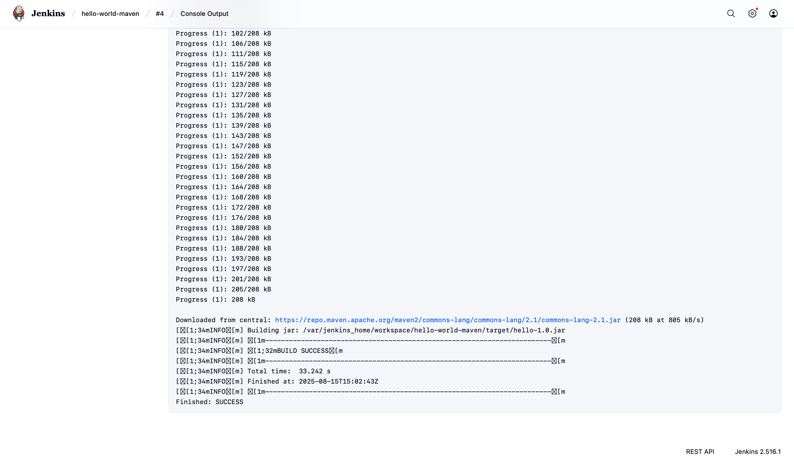

# TASK 8: Running a Simple Java Maven Build Job in Jenkins

## Objective
The objective of this task is to configure Jenkins to build a basic Java application using Maven.  
This exercise serves as an introduction to Continuous Integration (CI) concepts and helps in understanding the integration of build tools within a CI/CD pipeline.

---

## Tools & Technologies Used
- **Jenkins** (Docker container: `jenkins/jenkins:lts`)
- **Java JDK 8/11**
- **Apache Maven**
- **Docker Desktop**
- **Git** (optional for SCM integration)
- **Operating System**: macOS

---

## Project Structure
A simple Java application was created with the following structure:

hello-java-maven/
pom.xml
src/main/java/com/example/HelloWorld.java


### Source Code

**HelloWorld.java**
```java
package com.example;

public class HelloWorld {
    public static void main(String[] args) {
        System.out.println("Hello, Jenkins + Maven!");
    }
}
```

pom.xml
``` bash
<?xml version="1.0" encoding="UTF-8"?>
<project xmlns="http://maven.apache.org/POM/4.0.0"
         xmlns:xsi="http://www.w3.org/2001/XMLSchema-instance"
         xsi:schemaLocation="http://maven.apache.org/POM/4.0.0 https://maven.apache.org/xsd/maven-4.0.0.xsd">
    <modelVersion>4.0.0</modelVersion>
    <groupId>com.example</groupId>
    <artifactId>hello</artifactId>
    <version>1.0</version>
    <packaging>jar</packaging>

    <properties>
        <maven.compiler.source>1.8</maven.compiler.source>
        <maven.compiler.target>1.8</maven.compiler.target>
        <project.build.sourceEncoding>UTF-8</project.build.sourceEncoding>
    </properties>

    <build>
        <plugins>
            <plugin>
                <groupId>org.apache.maven.plugins</groupId>
                <artifactId>maven-compiler-plugin</artifactId>
                <version>3.8.1</version>
                <configuration>
                    <source>${maven.compiler.source}</source>
                    <target>${maven.compiler.target}</target>
                </configuration>
            </plugin>
        </plugins>
    </build>
</project>
```


### Procedure

###### Step 1: Running Jenkins via Docker

``` bash
docker run -d --name jenkins \
  -p 8080:8080 -p 50000:50000 \
  -v jenkins_home:/var/jenkins_home \
  jenkins/jenkins:lts
```

The Jenkins UI was accessed at: http://localhost:8080


###### Step 2: Installing Maven in Jenkins Container
During the initial build attempt, the following error occurred:
``` bash
java.io.IOException: Cannot run program "mvn": No such file or directory
```
This indicated Maven was not installed in the Jenkins container.
<b> Resolution: Install Maven as root inside the container </b>
``` bash
docker exec -u 0 -it jenkins bash
apt-get update
apt-get install -y maven
mvn -v
``` 

##### Step 4: Configuring the Jenkins Freestyle Job

- **New Item → Freestyle Project**
- **Source Code Management:**
    - Git (for remote repo) or None (for local bind-mounted code)
- **Build Step:**
    - Add Invoke top-level Maven targets
    - Select the Maven version configured earlier
    - Goals: clean package

- **Save and Build Now**


### Challenges Faced
1. Skipped Setup Wizard
    - Cause: Existing Jenkins volume containing prior configuration.
    - Solution: Removed the volume to trigger fresh setup.
2. Maven Not Found
    - Cause: Maven not preinstalled in the jenkins/jenkins:lts image.
    - Solution: Installed Maven manually using root access through jenkins CLI 
3. JDK Version Mismatch
    - Solution: Configured appropriate JDK in Global Tool Configuration.

### Outcome
- Successfully configured Jenkins to build a Java Maven project.
- Learned to handle missing tool installations in a containerized Jenkins environment.
- Achieved a BUILD SUCCESS status for the Maven-based HelloWorld application.

